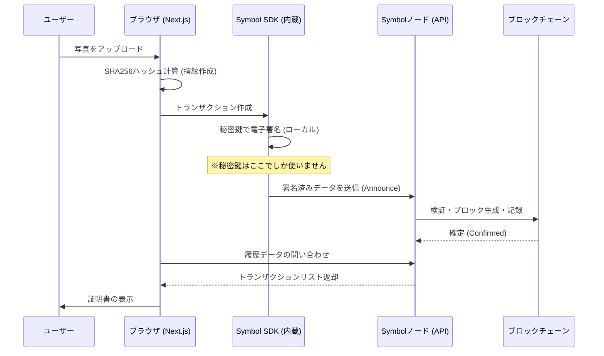

# 髭剃り証明 dApp (Shave Proof) - ウォークスルー

## 概要
NEM/Symbol ブロックチェーンを使用した「髭剃り証明」アプリの実装が完了しました。
ユーザーは写真をアップロードし、そのハッシュ値を「転送トランザクション」としてブロックチェーンに刻むことで、その日時に髭を剃ったことを証明できます。

## 実行方法

1.  **ディレクトリ移動**:
    ```bash
    cd D:\code\shave-proof
    ```

2.  **開発サーバーの起動**:
    ```bash
    npm run dev
    ```
    ブラウザで `http://localhost:3000` を開いてください。

    ※ ビルドして実行する場合:
    ```bash
    npx next build --webpack
    npm run start
    ```

## はじめての方へ: Symbol Testnet ウォレットの準備

アプリを試すには、テスト用の通貨（XYM）が入った「秘密鍵」が必要です。以下の手順で準備してください。

### 1. Symbol Desktop Wallet のインストール
PC用の公式ウォレットをインストールします。
*   [GitHub Releases](https://github.com/symbol/desktop-wallet/releases) にアクセス。
*   最新バージョンの `symbol-desktop-wallet-win-x.x.x.exe` をダウンロードしてインストールしてください。

### 2. テストネットプロファイルの作成
ウォレットを開き、以下の手順でプロファイルを作成します。
1.  「**Create a new profile?**」をクリック。
2.  `Profile Name`: 適当な名前（例: `TestUser`）
3.  `Select Network Type`: **Testnet** を選択（**重要！**）。
4.  パスワードを設定して次へ。
5.  マウスを動かしてランダム値を生成し、表示される「ニーモニック（英単語）」をメモします（テスト用なので適当なメモでOKですが、本来は重要です）。
6.  セットアップが完了すると、ダッシュボード画面が表示されます。

### 3. アドレスの確認と秘密鍵の取得
1.  左メニューの「**Accounts**」をクリック。
2.  表示されている **Address**（Tから始まる文字列）をコピーします。
3.  同じ画面の「**Private Key**」の目のアイコンをクリックし、パスワードを入力して表示された文字列（秘密鍵）もコピーして控えておきます。これがアプリへの入力に使います。

### 4. テスト用XYMの入手 (Faucet)
ウォレットを作っただけでは残高が0なので、無料配布サイト（Faucet）からもらいます。

**方法A: 公式Faucet (Twitter認証あり)**
1.  [Symbol Faucet](https://testnet.symbol.tools/) にアクセス。
2.  Twittter認証を行い、アドレスを入力して「CLAIM」。

**方法B: コミュニティDiscordで依頼する (確実)**
自動配布サイトが使えない場合、Discordコミュニティで依頼するのが一番確実です。
1.  **Symbol Community Discord** (または "NEM Symbol Discord" で検索) に参加します。
2.  `#faucet` または `#testnet` というチャンネルを探します（なければ `#japanese` でも親切な方が教えてくれます）。
3.  「テストネットのXYMをください」と書き込み、自分のアドレス（`T...`）を貼り付けます。
4.  コミュニティの有志の方が送ってくれます。

**方法C: Twitter認証なしFaucet (不安定)**
*   [Symbol Serverless Faucet](https://symbol-faucet.netlify.app/)
    *   ※「40 characters long」というエラーが出ることがあり、現在不安定なようです。

5.  数分後、Desktop Walletの残高が増えていることを確認します。

準備完了です！控えた「秘密鍵」を使ってアプリを動かしてみましょう。

## 使い方

1.  **準備 (Symbol Testnet 秘密鍵)**
    *   Symbol Testnetの秘密鍵をご用意ください（faucetでXYMを取得したアカウント）。
    *   **注意**: 秘密鍵はローカル端末のブラウザ内でのみ使用され、外部には送信されませんが、**必ずテストネット用のアカウント**を使用してください。

2.  **証明の作成 (Submit Proof)**
    *   秘密鍵を入力フォームに入力します。
    *   カメラアイコンをタップ/クリックして、髭を剃った写真を撮影または選択します。
    *   自動的にSHA256ハッシュが計算されます。
    *   「Submit Proof」ボタンを押します。

3.  **確認 (Verification)**
    *   トランザクションが送信されると、成功メッセージが表示されます。
    *   数秒後、下部の「Proof History」リストに新しい証明が表示されます。
    *   「View」リンクをクリックすると、公式ブロックエクスプローラー (symbol.fyi) で刻まれたハッシュ値を確認できます。

## 技術仕様
*   **チェーン**: Symbol Testnet
*   **トランザクションタイプ**: TransferTransaction (v1)
*   **メッセージ**: 写真のハッシュ値 (Plain Message)
*   **アドレスフォーマット**: 入力不要（秘密鍵から自動導出）

## デバッグ情報
*   Next.js 16 (Webpack) を使用。
## システムアーキテクチャ詳細

本アプリケーションは、従来のWeb2.0的なサーバー管理モデルとは異なり、ブロックチェーンをバックエンドとして活用する「フルオンチェーン（分散型）アーキテクチャ」を採用しています。

### 1. システム構成図

データの流れと主要コンポーネントの関係は以下の通りです。



### 2. データ管理と永続化
本アプリには**自前のデータベースやバックエンドサーバーは存在しません**。全ての信頼できるデータはパブリックブロックチェーン上に記録されます。

*   **フロントエンド**:
    *   Next.js (React) によって構築され、ユーザーのブラウザ上でJavaScriptとして動作します。
    *   計算処理（ハッシュ化）、暗号化処理（署名）はすべてユーザーの端末内で行われます。
*   **バックエンド (Blockchain)**:
    *   **役割**: 改ざん不可能な「タイムスタンプサーバー」として機能します。
    *   **保存場所**: 世界中に分散するSymbolノード群によって同期・保存されます。特定の管理者がデータを消去したり改変することはできません。
*   **API接続先**:
    *   アプリは `https://sym-test.opening-line.jp:3001` などのパブリックノードのエンドポイントに直接アクセスし、データの読み書きを行います。

### 3. トランザクションの構造
「髭を剃った証明」は、Symbolブロックチェーン上の「転送トランザクション (TransferTransaction)」として表現されています。

| 項目 | 値 | 意味 |
| :--- | :--- | :--- |
| **送信者 (Signer)** | ユーザーのアドレス | 「誰が」証明したか |
| **受信者 (Recipient)** | ユーザー自身 | 自分宛てに送ることで履歴に残す |
| **メッセージ (Message)** | 写真のハッシュ値 | 「何を」証明するか（写真のデジタル指紋） |
| **手数料 (Fee)** | XYM (最小限) | ネットワーク利用料 |
| **タイムスタンプ** | ブロック生成時刻 | 「いつ」証明されたか（ブロックチェーン時刻） |

### 4. セキュリティ設計
*   **秘密鍵の管理**: 秘密鍵はメモリ上（ReactのState）でのみ保持され、外部サーバーやデータベースには一切送信されません。ページをリロードすると消去される設計です。
*   **完全な透明性**: 記録された証明は `symbol.fyi` などのブロックエクスプローラーを通じて、アプリを経由せずに誰でも第三者が検証可能です。
