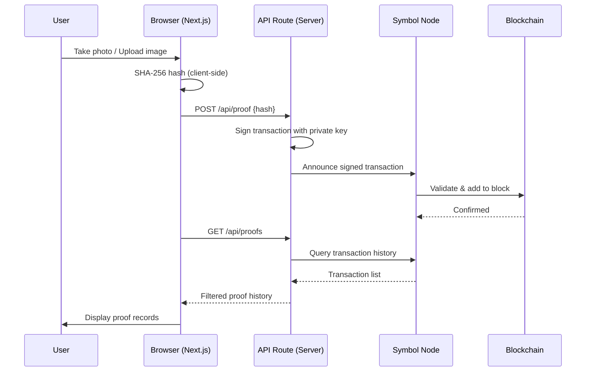

# HIGE - Hash-anchored Immutable Grooming Evidence

ブロックチェーンで刻む、毎日の身だしなみ証明 dApp

**Live Demo**: https://blockchain-hige.vercel.app

## Overview

HIGE は、毎日の身だしなみ（髭剃り等）の写真を撮影・アップロードし、その SHA256 ハッシュを Symbol Testnet ブロックチェーンに記録することで、「いつ・誰が・何を」証明したかを改ざん不可能な形で残す dApp です。

- 自前のデータベース・バックエンドサーバーは不要
- 記録はブロックエクスプローラーで誰でも第三者検証可能
- 秘密鍵はサーバー側の環境変数でのみ保持し、クライアントには送信しない

## Tech Stack

| Layer | Technology |
|:---|:---|
| Blockchain | Symbol (NEM) Testnet |
| Frontend | Next.js 16, React 19, Tailwind CSS 4 |
| Crypto | Web Crypto API (SHA-256), Symbol SDK v3 |
| Local Storage | IndexedDB (端末内写真保存) |
| Hosting | Vercel |

## Architecture



## Getting Started

### Prerequisites

- Node.js 20+
- Symbol Testnet account with XYM (for transaction fees)

### Setup

```bash
# Install dependencies
npm install

# Create .env.local
cp .env.local.example .env.local
# Edit .env.local with your Symbol Testnet private key

# Start development server
npm run dev
```

### Environment Variables

| Variable | Description | Required |
|:---|:---|:---|
| `SYMBOL_PRIVATE_KEY` | Symbol Testnet private key (64-char hex) | Yes |
| `SYMBOL_NODE_URL` | Symbol node endpoint | No (default: `https://sym-test-01.opening-line.jp:3001`) |

### Build

```bash
npm run build   # next build --webpack
npm run start
```

## How It Works

1. **Capture**: Take a photo with your camera or upload an image
2. **Hash**: The app computes the SHA-256 hash of the image client-side
3. **Record**: The hash is sent to the API, which signs a TransferTransaction and announces it to the Symbol network
4. **Verify**: The proof appears in the history list with a link to the block explorer for independent verification

### Transaction Structure

| Field | Value | Purpose |
|:---|:---|:---|
| Signer | Server account | Who submitted the proof |
| Recipient | Self-transfer | Keep in transaction history |
| Message | SHA-256 hash of photo | Digital fingerprint of evidence |
| Fee | Minimal XYM | Network fee |
| Timestamp | Block time | When the proof was anchored |

## Project Structure

```
app/
  layout.tsx          # Root layout with metadata
  page.tsx            # Main page (client component)
  api/
    proof/route.ts    # POST: Create & announce proof transaction
    proofs/route.ts   # GET: Fetch proof history from blockchain
components/
  CameraCapture.tsx   # Camera capture & file upload component
  VerifySection.tsx   # Verification & tamper demo section
lib/
  symbolProof.ts      # Symbol SDK wrapper (server-side)
  photoStore.ts       # IndexedDB photo storage
```

## Security

- Private key is stored only in server-side environment variables
- Client never handles or sees the private key
- All hashing is done client-side using Web Crypto API
- Proofs are independently verifiable on the public blockchain

## License

MIT
