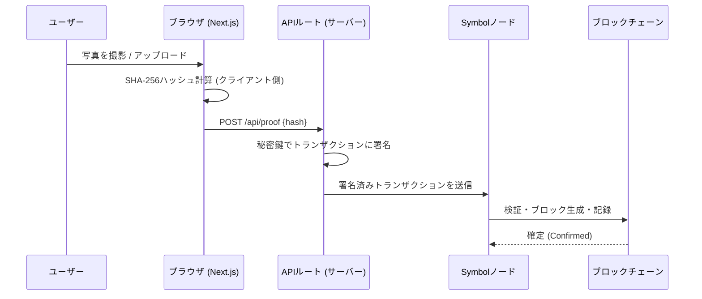
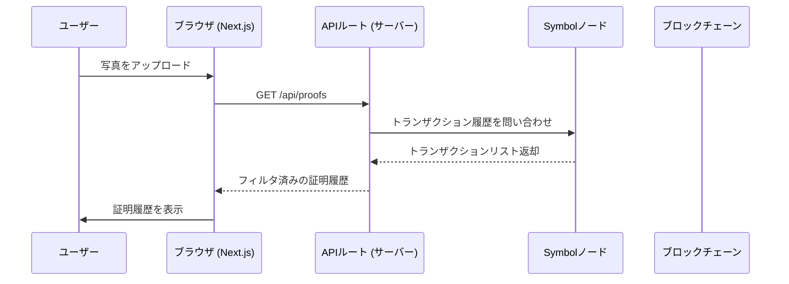

# HIGE - Hash-anchored Immutable Grooming Evidence

ブロックチェーンで刻む、毎日の身だしなみ証明 dApp

**デモサイト**: https://blockchain-hige.vercel.app

**動画デモ**: https://www.youtube.com/shorts/I_izoyQNiq8

## 概要

HIGE は、毎日の身だしなみ（髭剃り等）の写真を撮影・アップロードし、その SHA256 ハッシュを Symbol Testnet ブロックチェーンに記録することで、「いつ・誰が・何を」証明したかを改ざん不可能な形で残す dApp です。

- 自前のデータベース・バックエンドサーバーは不要
- 記録はブロックエクスプローラーで誰でも第三者検証可能
- 秘密鍵はサーバー側の環境変数でのみ保持し、クライアントには送信しない

## 技術スタック

| レイヤー | 技術 |
|:---|:---|
| ブロックチェーン | Symbol (NEM) Testnet |
| フロントエンド | Next.js 16, React 19, Tailwind CSS 4 |
| 暗号処理 | Web Crypto API (SHA-256), Symbol SDK v3 |
| 端末内保存 | IndexedDB (写真のローカル保存) |
| ホスティング | Vercel |

## アーキテクチャ
### システム構成図


### シーケンス図
#### 証拠画像登録

#### 証拠画像照合



## セットアップ

### 必要なもの

- Node.js 20+
- Symbol Testnet アカウント（トランザクション手数料用の XYM が必要）

### インストール

```bash
# 依存パッケージのインストール
npm install

# 環境変数ファイルの作成
cp .env.local.example .env.local
# .env.local を編集し、Symbol Testnet の秘密鍵を設定

# 開発サーバーの起動
npm run dev
```

ブラウザで http://localhost:3000 を開いてください。

### 環境変数

| 変数名 | 説明 | 必須 |
|:---|:---|:---|
| `SYMBOL_PRIVATE_KEY` | Symbol Testnet の秘密鍵（64文字の16進数） | はい |
| `SYMBOL_NODE_URL` | Symbol ノードのエンドポイント | いいえ（デフォルト: `https://sym-test-01.opening-line.jp:3001`） |

### ビルド

```bash
npm run build   # next build --webpack
npm run start
```

## 使い方

1. **撮影 / アップロード**: カメラで写真を撮影するか、画像ファイルをアップロード
2. **ハッシュ化**: アプリがクライアント側で画像の SHA-256 ハッシュを計算
3. **記録**: ハッシュが API に送信され、サーバー側で TransferTransaction に署名・Symbol ネットワークにアナウンス
4. **検証**: 証明履歴に記録が表示され、ブロックエクスプローラーへのリンクから誰でも独立して検証可能

### トランザクションの構造

| 項目 | 値 | 意味 |
|:---|:---|:---|
| 送信者 (Signer) | サーバーアカウント | 誰が証明を提出したか |
| 受信者 (Recipient) | 自分宛て | トランザクション履歴に残すため |
| メッセージ (Message) | 写真の SHA-256 ハッシュ | 証拠のデジタル指紋 |
| 手数料 (Fee) | 最小限の XYM | ネットワーク手数料 |
| タイムスタンプ | ブロック生成時刻 | いつ証明が刻まれたか |

## プロジェクト構成

```
app/
  layout.tsx          # ルートレイアウト・メタデータ
  page.tsx            # メインページ (クライアントコンポーネント)
  api/
    proof/route.ts    # POST: 証明トランザクションの作成・送信
    proofs/route.ts   # GET: ブロックチェーンから証明履歴を取得
components/
  CameraCapture.tsx   # カメラ撮影・ファイルアップロードコンポーネント
  VerifySection.tsx   # 検証・改ざんデモセクション
lib/
  symbolProof.ts      # Symbol SDK ラッパー (サーバーサイド)
  photoStore.ts       # IndexedDB 写真ストレージ
```

## セキュリティ

- 秘密鍵はサーバー側の環境変数にのみ保持し、クライアントには一切送信しない
- ハッシュ計算はすべてクライアント側の Web Crypto API で実行
- 記録された証明はパブリックブロックチェーン上で誰でも独立して検証可能

## ライセンス

MIT
